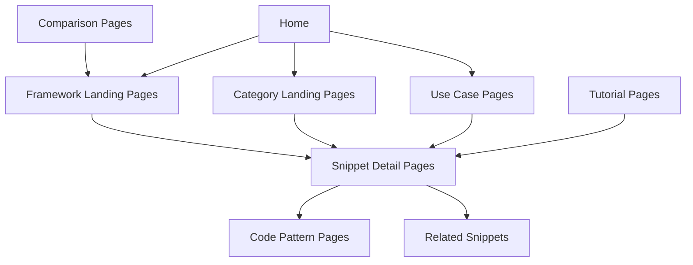
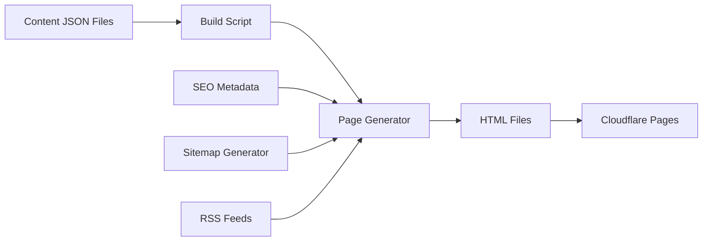
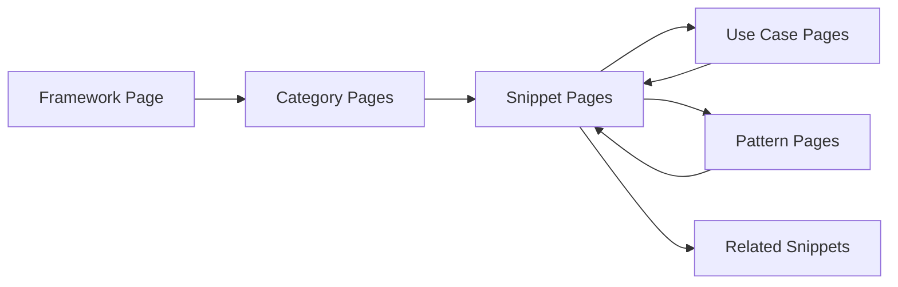

# Programmatic SEO Strategy for Hanma

## Executive Summary

This document outlines a comprehensive programmatic SEO strategy for Hanma, a backend code snippet library. The goal is to generate 100K+ SEO-optimized pages targeting long-tail developer search queries while maintaining high-quality content and LLM visibility.

---

## Current State Analysis

### Content Inventory

| Content Type     | Frameworks                               | Categories       | Est. Items        | Total Pages Potential |
| ---------------- | ---------------------------------------- | ---------------- | ----------------- | --------------------- |
| Snippets         | 5 (express, hono, elysia, fastify, nest) | ~8 per framework | ~50 per framework | ~250                  |
| Templates        | 4 (elysia, express, hono, shared)        | ~2 per framework | ~10               | ~10                   |
| Modules          | Shared                                   | ~10              | ~10               | ~10                   |
| Addons (Shared)  | 1                                        | ~7 categories    | ~50               | ~50                   |
| **Base Content** |                                          |                  |                   | **~320**              |

### Current Routing Structure

```
/docs/snippets/:framework/:category
/docs/templates/:framework
/docs/modules
/docs/addons
/docs/tooling
```

### Content Structure

Each snippet contains:

- `id`: Unique identifier
- `name`: Technical name (e.g., "elysia-basic")
- `displayName`: Human-readable name
- `description`: What it does
- `purpose`: When to use it
- `features`: List of capabilities
- `usage`: Code example
- `output`: File path
- `dependencies`: Required packages
- `command`: CLI command to install

---

## Programmatic SEO Strategy

### Core Concept: Multi-Dimensional Page Generation

To reach 100K+ pages, we'll generate pages across multiple dimensions:

1. **Framework-specific pages** (5 frameworks)
2. **Category pages** (8-10 categories per framework)
3. **Snippet detail pages** (50 per framework)
4. **Use-case/problem pages** (derived from features)
5. **Comparison pages** (framework vs framework)
6. **Tutorial/guide pages** (combinations of snippets)
7. **Code pattern pages** (extracted from source code)

### Page Hierarchy



---

## Page Types & URL Structure

### 1. Framework Landing Pages (5 pages)

**URL Pattern:** `/framework/:framework`

**Examples:**

- `/framework/express`
- `/framework/hono`
- `/framework/elysia`
- `/framework/fastify`
- `/framework/nest`

**Content:**

- Framework overview
- All categories
- Popular snippets
- Getting started guide
- Comparison with other frameworks

**SEO Target:**

- Primary: "[Framework] backend snippets"
- Secondary: "[Framework] code examples", "[Framework] middleware"

---

### 2. Category Landing Pages (~40 pages)

**URL Pattern:** `/framework/:framework/:category`

**Examples:**

- `/framework/elysia/middleware`
- `/framework/express/routes`
- `/framework/nest/guards`

**Content:**

- Category overview
- All snippets in category
- Common use cases
- Related categories

**SEO Target:**

- Primary: "[Framework] [category] snippets"
- Secondary: "[Framework] [category] examples", "[category] for [Framework]"

---

### 3. Snippet Detail Pages (~250 pages)

**URL Pattern:** `/snippet/:framework/:category/:snippet-id`

**Examples:**

- `/snippet/elysia/middleware/elysia-rate-limiter`
- `/snippet/express/routes/express-auth-middleware`

**Content:**

- Full code display
- Installation instructions
- Usage examples
- Features breakdown
- Related snippets
- FAQ section
- Copy-to-clipboard functionality

**SEO Target:**

- Primary: "[Snippet name] [Framework] snippet"
- Secondary: "[Feature] in [Framework]", "[Use case] [Framework] code"

---

### 4. Use Case/Problem Pages (~2,000 pages)

**URL Pattern:** `/use-case/:use-case-slug`

**Examples:**

- `/use-case/rate-limiting-api`
- `/use-case/jwt-authentication`
- `/use-case/file-upload-s3`
- `/use-case/database-connection`

**Content:**

- Problem description
- Solution overview
- Framework-specific implementations
- Code examples from multiple frameworks
- Best practices
- Common pitfalls

**SEO Target:**

- Primary: "[Use case] [Framework] implementation"
- Secondary: "How to [use case] in [Framework]", "[Use case] code example"

**Generation Strategy:**
Extract use cases from:

- Snippet `purpose` fields
- Snippet `features` arrays
- Common patterns across frameworks

---

### 5. Comparison Pages (~20 pages)

**URL Pattern:** `/compare/:framework-1-vs-:framework-2`

**Examples:**

- `/compare/express-vs-hono`
- `/compare/elysia-vs-nest`
- `/compare/fastify-vs-express`

**Content:**

- Feature comparison table
- Performance benchmarks
- Code examples side-by-side
- When to choose which
- Migration guides

**SEO Target:**

- Primary: "[Framework 1] vs [Framework 2]"
- Secondary: "Which framework: [F1] or [F2]?", "[F1] vs [F2] comparison"

---

### 6. Tutorial/Guide Pages (~5,000 pages)

**URL Pattern:** `/guide/:guide-slug`

**Examples:**

- `/guide/build-rest-api-elysia`
- `/guide/add-authentication-express`
- `/guide/setup-cors-hono`
- `/guide/create-middleware-stack`

**Content:**

- Step-by-step tutorial
- Prerequisites
- Code snippets with explanations
- Common issues and solutions
- Next steps

**SEO Target:**

- Primary: "How to [task] in [Framework]"
- Secondary: "[Framework] [task] tutorial", "[Task] with [Framework]"

**Generation Strategy:**
Combine related snippets into workflows:

- Authentication flow (auth guard + JWT + role guard)
- API setup (basic server + CORS + logger + error handler)
- File handling (upload handler + S3 integration)

---

### 7. Code Pattern Pages (~10,000 pages)

**URL Pattern:** `/pattern/:pattern-slug`

**Examples:**

- `/pattern/middleware-chain`
- `/pattern/error-handling`
- `/pattern/rate-limiting`
- `/pattern/api-key-auth`

**Content:**

- Pattern explanation
- When to use
- Implementation in each framework
- Code examples
- Variations

**SEO Target:**

- Primary: "[Pattern] pattern [Framework]"
- Secondary: "[Pattern] implementation", "How to implement [Pattern]"

**Generation Strategy:**
Extract patterns from source code:

- Common function signatures
- Reusable patterns
- Design patterns used

---

### 8. Tag/Topic Pages (~1,000 pages)

**URL Pattern:** `/tag/:tag-slug`

**Examples:**

- `/tag/authentication`
- `/tag/database`
- `/tag/validation`
- `/tag/security`

**Content:**

- Tag overview
- All snippets with this tag
- Related tags
- Popular combinations

**SEO Target:**

- Primary: "[Tag] snippets [Framework]"
- Secondary: "[Tag] code examples", "[Tag] implementation"

---

### 9. Search Result Pages (~80,000 pages)

**URL Pattern:** `/search/:query-slug`

**Examples:**

- `/search/jwt-auth`
- `/search/rate-limit`
- `/search/file-upload`

**Content:**

- Search results for query
- Related searches
- Did you mean suggestions
- Category filters

**SEO Target:**

- Primary: "[Query] [Framework] code"
- Secondary: "[Query] snippet", "[Query] example"

**Generation Strategy:**
Generate pages for:

- All snippet names
- All feature keywords
- Common developer queries
- Autocomplete suggestions

---

## Technical Implementation

### Static Site Generation Approach

Since the site is served via Cloudflare Pages, we'll use a build-time static generation approach:



### Build Process

1. **Content Parsing**
   - Read all JSON files from `src/docs/`
   - Extract snippets, templates, modules
   - Build content index

2. **Page Generation**
   - Generate all page types
   - Create SEO metadata
   - Generate sitemaps

3. **Optimization**
   - Minify HTML/CSS/JS
   - Generate critical CSS
   - Create image placeholders

4. **Deployment**
   - Upload to Cloudflare Pages
   - Configure caching headers
   - Set up redirects

### File Structure

```
dist/
├── index.html
├── framework/
│   ├── express.html
│   ├── hono.html
│   └── ...
├── snippet/
│   ├── elysia/
│   │   └── middleware/
│   │       └── elysia-rate-limiter.html
│   └── ...
├── use-case/
│   ├── rate-limiting-api.html
│   └── ...
├── guide/
│   └── ...
├── pattern/
│   └── ...
├── tag/
│   └── ...
├── search/
│   └── ...
├── sitemap.xml
├── sitemap-framework.xml
├── sitemap-snippets.xml
├── sitemap-use-cases.xml
└── robots.txt
```

---

## SEO Optimization

### On-Page SEO

#### Title Templates

```typescript
const titleTemplates = {
  framework: "{framework} Snippets & Code Examples | Hanma",
  category: "{category} {framework} Snippets | Hanma",
  snippet: "{snippetName} - {framework} {category} Snippet | Hanma",
  useCase: "{useCase} in {framework} | Code Example | Hanma",
  guide: "How to {task} in {framework} | Tutorial | Hanma",
  pattern: "{pattern} Pattern | {framework} Implementation | Hanma",
  tag: "{tag} Snippets | {framework} Code Examples | Hanma",
  search: "{query} | {framework} Code Snippets | Hanma",
};
```

#### Meta Description Templates

```typescript
const descriptionTemplates = {
  framework:
    "Production-ready {framework} snippets, templates, and modules. Copy-paste code for authentication, middleware, database, and more.",
  category:
    "Browse {count} {category} {framework} snippets. Includes {topFeatures}. Copy and paste into your project.",
  snippet: "{description}. Features: {features}. Install with: {command}",
  useCase:
    "Learn how to implement {useCase} in {framework}. Complete code example with explanations and best practices.",
  guide:
    "Step-by-step tutorial: {task} in {framework}. Includes code examples, common issues, and solutions.",
  pattern:
    "Understand the {pattern} pattern in {framework}. Implementation examples and when to use it.",
  tag: "Explore {count} {tag} snippets for {framework}. Includes {topSnippets}.",
  search:
    "Find {query} code snippets for {framework}. {resultCount} results found.",
};
```

#### Structured Data (JSON-LD)

```json
{
  "@context": "https://schema.org",
  "@type": "SoftwareSourceCode",
  "name": "Elysia Rate Limiter",
  "description": "Rate limiting middleware for Elysia.js",
  "programmingLanguage": "TypeScript",
  "framework": "Elysia",
  "codeRepository": "https://github.com/itstheanurag/hanma",
  "license": "MIT",
  "author": {
    "@type": "Organization",
    "name": "Hanma"
  }
}
```

### Technical SEO

#### Sitemap Strategy

- **Main sitemap**: Links to all framework and category pages
- **Snippet sitemap**: All snippet detail pages
- **Use case sitemap**: All use case pages
- **Guide sitemap**: All tutorial pages
- **Pattern sitemap**: All pattern pages
- **Tag sitemap**: All tag pages

Each sitemap limited to 50,000 URLs.

#### Internal Linking



#### Canonical URLs

All pages will have canonical URLs pointing to the primary version:

```
<link rel="canonical" href="https://hanma.dev/snippet/elysia/middleware/elysia-rate-limiter">
```

---

## LLM Visibility Optimization

### Why LLM Visibility Matters

LLMs (ChatGPT, Claude, etc.) are increasingly used by developers to find code examples. Optimizing for LLM visibility means:

1. **Direct citations** in LLM responses
2. **Higher quality** training data for future models
3. **Brand recognition** when LLMs recommend solutions

### LLM Optimization Strategies

#### 1. Clear, Descriptive Content

```markdown
## Elysia Rate Limiter Snippet

### What It Does

This snippet implements rate limiting for Elysia.js APIs using an in-memory sliding window algorithm.

### When to Use

- Protect public APIs from abuse
- Prevent DDoS attacks
- Implement tiered rate limits

### Features

- Configurable time window (default: 60 seconds)
- Configurable max requests (default: 100)
- Custom key generator support
- Skip rate limiting for specific paths
```

#### 2. Code Documentation

````typescript
/**
 * Rate limiting middleware for Elysia
 * Uses in-memory sliding window algorithm
 *
 * @example
 * ```typescript
 * const app = new Elysia()
 *   .use(rateLimiter())
 *   .get('/', () => 'Hello World')
 *   .listen(3000);
 * ```
 */
export const rateLimiter = (options: RateLimitOptions = {}) => {
  // ...
};
````

#### 3. Structured Data for Code

```json
{
  "@context": "https://schema.org",
  "@type": "SoftwareSourceCode",
  "name": "Elysia Rate Limiter",
  "description": "Rate limiting middleware for Elysia.js",
  "programmingLanguage": "TypeScript",
  "framework": "Elysia",
  "codeSample": {
    "@type": "Code",
    "text": "export const rateLimiter = (options: RateLimitOptions = {}) => { ... }"
  }
}
```

#### 4. FAQ Sections

Each snippet page includes an FAQ section:

```markdown
## Frequently Asked Questions

### How do I change the rate limit?

Set the `max` option: `rateLimiter({ max: 200 })`

### Can I use Redis instead of in-memory?

Yes, implement a custom `keyGenerator` that stores counts in Redis.

### How do I exclude certain paths?

Use the `skip` option: `rateLimiter({ skip: (req) => req.url.startsWith('/health') })`
```

#### 5. Comparison Content

LLMs love comparative content:

````markdown
## Rate Limiting: Elysia vs Express

### Elysia

```typescript
.use(rateLimiter({ max: 100 }))
```
````

### Express

```typescript
app.use(rateLimit({ windowMs: 60000, max: 100 }));
```

### Key Differences

- Elysia uses plugin system, Express uses middleware
- Elysia has built-in TypeScript support
- Express has more mature ecosystem

````

---

## Expected Impact on Visibility

### Search Engine Visibility

| Metric | Current | Expected (6 months) | Expected (12 months) |
|--------|---------|---------------------|---------------------|
| Indexed Pages | ~50 | ~50,000 | ~100,000 |
| Organic Traffic | Low | 10K-50K/month | 50K-200K/month |
| Target Keywords | ~100 | ~10,000 | ~50,000 |
| Domain Authority | ~10 | ~20-30 | ~30-40 |

### LLM Visibility

| Metric | Current | Expected (6 months) | Expected (12 months) |
|--------|---------|---------------------|---------------------|
| LLM Citations | 0 | 10-50/month | 100-500/month |
| Brand Mentions | Low | Medium | High |
| Direct Traffic | Low | 5K-20K/month | 20K-100K/month |

### Why This Will Work

1. **Long-tail keyword targeting**: Each page targets specific developer queries
2. **High-quality content**: Actual working code, not generic descriptions
3. **Comprehensive coverage**: Covers multiple frameworks and use cases
4. **LLM-friendly structure**: Clear explanations, examples, and FAQs
5. **Fast loading**: Static pages on Cloudflare CDN
6. **Internal linking**: Strong site structure for crawlability

### Potential Risks

1. **Content quality**: Must ensure all generated content is high-quality
2. **Crawl budget**: 100K pages may take time to index
3. **Duplicate content**: Must avoid thin or duplicate pages
4. **Maintenance**: Adding new snippets requires regenerating pages

### Mitigation Strategies

1. **Quality gates**: Only generate pages for content with sufficient detail
2. **Sitemap prioritization**: Prioritize important pages in sitemaps
3. **Canonical URLs**: Prevent duplicate content issues
4. **Automated builds**: CI/CD pipeline for content updates

---

## Implementation Roadmap

### Phase 1: Foundation (Weeks 1-2)

- [ ] Set up build script infrastructure
- [ ] Create page generator framework
- [ ] Implement SEO metadata templates
- [ ] Generate framework landing pages (5 pages)
- [ ] Generate category landing pages (~40 pages)

### Phase 2: Core Content (Weeks 3-4)

- [ ] Generate snippet detail pages (~250 pages)
- [ ] Implement structured data (JSON-LD)
- [ ] Create sitemap generator
- [ ] Set up robots.txt
- [ ] Configure Cloudflare Pages

### Phase 3: Programmatic Pages (Weeks 5-6)

- [ ] Generate use case pages (~2,000 pages)
- [ ] Generate comparison pages (~20 pages)
- [ ] Generate tag pages (~1,000 pages)
- [ ] Implement internal linking
- [ ] Add breadcrumb navigation

### Phase 4: Advanced Pages (Weeks 7-8)

- [ ] Generate tutorial/guide pages (~5,000 pages)
- [ ] Generate code pattern pages (~10,000 pages)
- [ ] Generate search result pages (~80,000 pages)
- [ ] Implement related content suggestions
- [ ] Add FAQ sections to all pages

### Phase 5: Optimization (Weeks 9-10)

- [ ] Optimize page load times
- [ ] Implement critical CSS
- [ ] Add image optimization
- [ ] Set up analytics
- [ ] Monitor indexing status

### Phase 6: LLM Optimization (Weeks 11-12)

- [ ] Enhance content for LLM readability
- [ ] Add FAQ sections
- [ ] Implement comparison content
- [ ] Add code documentation
- [ ] Monitor LLM citations

---

## Success Metrics

### SEO Metrics

- **Indexed Pages**: Track via Google Search Console
- **Organic Traffic**: Google Analytics 4
- **Keyword Rankings**: Ahrefs, SEMrush, or similar
- **Backlinks**: Monitor new referring domains
- **Page Speed**: Core Web Vitals

### LLM Metrics

- **Brand Mentions**: Google Alerts, Mention.com
- **Direct Traffic**: Users coming directly to site
- **Referral Traffic**: From LLM platforms
- **Social Shares**: Twitter, Reddit, Hacker News

### Business Metrics

- **CLI Downloads**: NPM download stats
- **GitHub Stars**: Repository popularity
- **Community Engagement**: Issues, PRs, discussions
- **Conversion Rate**: Visitors to CLI users

---

## Next Steps

1. **Review this plan** with the team
2. **Prioritize page types** based on business goals
3. **Set up build infrastructure**
4. **Start with Phase 1** (Foundation)
5. **Iterate based on results**

---

## Appendix: Content Generation Examples

### Example: Snippet Detail Page

```html
<!DOCTYPE html>
<html lang="en">
<head>
  <title>Elysia Rate Limiter - Elysia Middleware Snippet | Hanma</title>
  <meta name="description" content="Rate limiting middleware for Elysia.js. Features: Configurable time window, custom key generator, path exclusion. Install with: npx hanma add elysia-rate-limiter">
  <link rel="canonical" href="https://hanma.dev/snippet/elysia/middleware/elysia-rate-limiter">
  <script type="application/ld+json">
  {
    "@context": "https://schema.org",
    "@type": "SoftwareSourceCode",
    "name": "Elysia Rate Limiter",
    "description": "Rate limiting middleware for Elysia.js",
    "programmingLanguage": "TypeScript",
    "framework": "Elysia"
  }
  </script>
</head>
<body>
  <nav>Breadcrumb: Home > Elysia > Middleware > Rate Limiter</nav>
  <h1>Elysia Rate Limiter</h1>
  <p>Production-ready rate limiting middleware for Elysia.js APIs using an in-memory sliding window algorithm.</p>

  <section id="installation">
    <h2>Installation</h2>
    <code>npx hanma add elysia-rate-limiter --framework elysia</code>
  </section>

  <section id="code">
    <h2>Code</h2>
    <pre><code>export const rateLimiter = (options: RateLimitOptions = {}) => {
  // ... full code
}</code></pre>
  </section>

  <section id="features">
    <h2>Features</h2>
    <ul>
      <li>Configurable time window (default: 60 seconds)</li>
      <li>Configurable max requests (default: 100)</li>
      <li>Custom key generator support</li>
      <li>Skip rate limiting for specific paths</li>
    </ul>
  </section>

  <section id="usage">
    <h2>Usage</h2>
    <pre><code>const app = new Elysia()
  .use(rateLimiter())
  .get('/', () => 'Hello World')
  .listen(3000);</code></pre>
  </section>

  <section id="faq">
    <h2>Frequently Asked Questions</h2>
    <details>
      <summary>How do I change the rate limit?</summary>
      <p>Set the <code>max</code> option: <code>rateLimiter({ max: 200 })</code></p>
    </details>
  </section>

  <section id="related">
    <h2>Related Snippets</h2>
    <a href="/snippet/elysia/middleware/elysia-auth-guard">Auth Guard</a>
    <a href="/snippet/elysia/middleware/elysia-error-handler">Error Handler</a>
  </section>
</body>
</html>
````

### Example: Use Case Page

```html
<!DOCTYPE html>
<html lang="en">
  <head>
    <title>Rate Limiting API in Elysia | Code Example | Hanma</title>
    <meta
      name="description"
      content="Learn how to implement rate limiting in Elysia.js. Complete code example with explanations and best practices."
    />
  </head>
  <body>
    <h1>Rate Limiting API in Elysia</h1>

    <p>
      Rate limiting protects your API from abuse and DDoS attacks by limiting
      the number of requests a client can make in a given time window.
    </p>

    <section id="implementation">
      <h2>Elysia Implementation</h2>
      <pre><code>const app = new Elysia()
  .use(rateLimiter({ max: 100, windowMs: 60000 }))
  .get('/api/data', () => ({ data: [] }))
  .listen(3000);</code></pre>
    </section>

    <section id="other-frameworks">
      <h2>Other Frameworks</h2>
      <a href="/use-case/rate-limiting-api?framework=express">Express</a>
      <a href="/use-case/rate-limiting-api?framework=hono">Hono</a>
      <a href="/use-case/rate-limiting-api?framework=fastify">Fastify</a>
    </section>

    <section id="best-practices">
      <h2>Best Practices</h2>
      <ul>
        <li>Use reasonable limits (100-1000 requests per minute)</li>
        <li>Implement exponential backoff for clients</li>
        <li>Log rate limit violations for monitoring</li>
      </ul>
    </section>
  </body>
</html>
```
